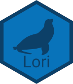

<!-- README.md is generated from README.Rmd. Please edit that file -->

```{r, include = FALSE}
knitr::opts_chunk$set(
  collapse = TRUE,
  comment = "#>",
  fig.path = "man/figures/README-",
  out.width = "100%"
)
```

# Lori 

<!-- badges: start -->
<!-- badges: end -->

The goal of Lori is to provide a simple package with useful functions(atleast for myself).

## Installation

You can install the development version of Lori from [GitHub](https://github.com/jakubkovac/Lori/) with:

``` r
# install.packages("devtools")
devtools::install_github("jakubkovac/Lori")
```

```{r colors}
Lori::list_plotter(Lori::lori_pal)
```
