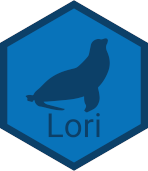
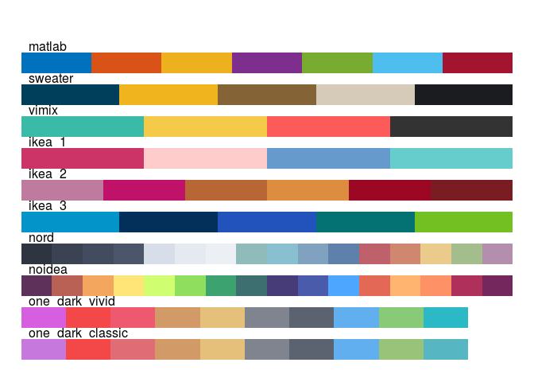

<!-- README.md is generated from README.Rmd. Please edit that file -->

# Lori 

<!-- badges: start -->

<!-- badges: end -->

The goal of Lori is to provide a simple package with useful
functions(atleast for myself).

## Installation

You can install the development version of Lori from
[GitHub](https://github.com/jakubkovac/Lori/) with:

``` r
# install.packages("devtools")
devtools::install_github("jakubkovac/Lori")
```

## Useful color palettes

``` r
Lori::list_plotter(Lori::lori_pal)
```


